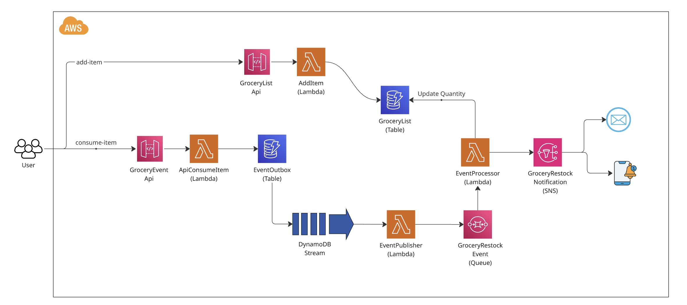

# Personalized Grocery Restocking System (Event Driven Architecture)

The **Personalized Grocery Restocking System** is designed to help individuals and families manage their grocery needs efficiently by sending reminders for restocking commonly used items (milk, bread, eggs, etc.) based on consumption patterns. It also suggests purchases based on personal preferences, seasonal changes, and past shopping behavior, ensuring that the user never runs out of essential items.

### **Key Features**

1. **Consumption Tracking**:
   - The system tracks the consumption of grocery items by monitoring user input (either manually through an app or automatically through IoT-connected devices like smart fridges).
   - It can track usage frequency and calculate when the user will likely run out of certain items.
2. **Smart Recommendations**:
   - Uses historical data, seasonal trends, and personal preferences to suggest grocery items that the user may want to buy.
   - For example, the system might suggest that the user order more soup ingredients during winter or snacks during movie nights.
3. **Automatic List Creation**:
   - As the system learns from user behavior, it automatically generates a shopping list of needed items based on consumption patterns (e.g., if the system notices that milk is consumed quickly, it will remind the user to buy it before it runs out).
   - Users can also add custom items to their list.
4. **Restock Alerts & Notifications**:
   - Sends **timely alerts** to remind users when it’s time to purchase commonly used items, ensuring they don't run out.
   - Alerts can be scheduled (e.g., weekly, monthly) or sent based on the depletion rate of an item (e.g., after consuming 80% of a carton of milk).
5. **Integration with Grocery Stores**:
   - The system can integrate with online grocery delivery services (e.g., Instacart, Amazon Fresh) to allow users to place orders directly from the app.
   - It can also show available discounts or offers on items the user frequently buys.
6. **Recurring Purchases & Subscriptions**:
   - Users can set up recurring purchases for frequently bought items (e.g., weekly vegetable delivery, monthly toilet paper).
   - The system can automatically order them for delivery on a set schedule.

---

### **Direct Stream Handler Architecture**

The system uses a **Direct Stream Handler** pattern for fast and reliable event processing. This approach provides better performance and simpler architecture compared to the traditional outbox pattern:

1. **PantryItems Table with DynamoDB Streams**:
   - When a user marks an item as "finished" (consumed), the system directly decrements the quantity in the **PantryItems** table.
   - DynamoDB Streams automatically captures all changes to the table with both old and new images.
2. **Direct Stream Handler (PantryItemsStreamHandler)**:
   - A Lambda function is triggered directly by DynamoDB Streams when quantity decreases are detected.
   - The handler processes events in real-time (~50-200ms latency) and updates the **GroceryList** table.
   - Includes retry logic with exponential backoff and dead-letter queue (DLQ) for failed events.
3. **Error Handling & Reliability**:
   - **Retry Mechanism**: Automatic retries with exponential backoff (1s, 2s, 4s) for transient failures.
   - **Dead-Letter Queue**: Failed events after retries are sent to SQS DLQ for manual investigation and reprocessing.
   - **Batch Bisection**: Automatically splits batches on errors to isolate problematic records.
   - **24-Hour Retention**: DynamoDB Streams retain events for 24 hours, ensuring no data loss.

---

### **High-Level Architecture Diagram**

---

## **Event Flow Based on Completed Architecture**

1️⃣ **User clicks "Finished" button** → Calls `/consume-item` API which directly decrements quantity in **PantryItems** table.

2️⃣ **DynamoDB Streams detects quantity change** → Automatically triggers **PantryItemsStreamHandler** Lambda (NEW_AND_OLD_IMAGES stream view).

3️⃣ **PantryItemsStreamHandler processes the event** → Detects quantity decrease and directly updates **GroceryList** table.

4️⃣ **Error Handling** → If processing fails, the handler retries up to 3 times with exponential backoff. After all retries fail, the event is sent to **Dead-Letter Queue (DLQ)** for manual investigation.

**Benefits of Direct Stream Handler:**
- ⚡ **3-10x faster** than outbox pattern (~50-200ms vs ~500ms-2s latency)
- 🔄 **Automatic retries** with exponential backoff
- 📦 **Dead-letter queue** for failed events
- 🎯 **Simpler architecture** with fewer components
- ✅ **Built-in reliability** with DynamoDB Streams 24-hour retention
